# Setup
You can access the setup when you are logged in as administrator and then select the gear icon in the menu bar.

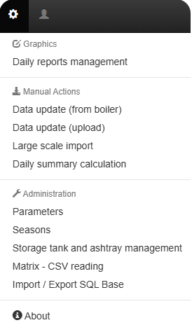

## Daily Reports Management
In this section you will choose what are the displayed information on your Home page.

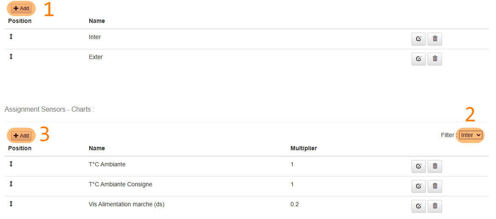

1. First create a chart
2. Then Select the chart in the list
3. Finally Add the parameters you want to see in there.
4. You can chnage the multiplier of a parameter if needed.

## Manual Actions

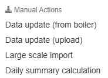

In this section you have access to manual data import and manual daily calculation in case you want to change a report or update it.

## Parameters
### Boiler Communication
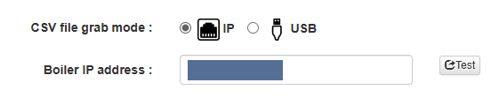

In here you can select if you get your input data via USB or IP.

> If you connected the boiler to your network, then choose IP and enter the boiler's IP address.
You need to execute the test to validate the parameter.

### Application Settings

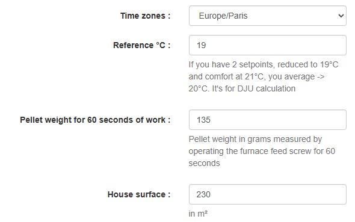

- Reference °C 
    > In here you can specify you reference temperature that will be used for the DJU (Degré Jour Unifié / Day Degree Unification) caculation.
- Pellet Weights
    > This is the magic parameter to calculate the consumption of your boiler. You need to let your feeding screw turn for 60 seconds, then take back the pellets and weigh it. Finally, enter the grams value.
- House surface
    > Speaks for itself. Give the value in m².

### Storage and Ashtray management

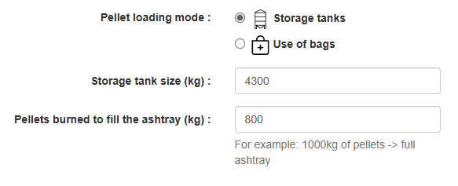

This is where you specify the size of your storage and ashtray.

Of course the ashtray size is a value you will learn with time.

### Analytics

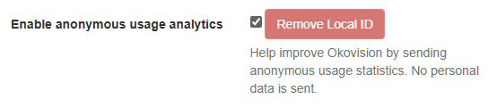

This is an optional parameter.

It helps the contributing knowing how many installations are running and maintained.

It will also help for supporting in case of issue.

Here are the shared informations:

- Okovision version
- PHP version
- Random ID generated during install
- Date of installation
- Last activity

### Language

There you can choose to use Okovision 2023 in French or English.

## Seasons

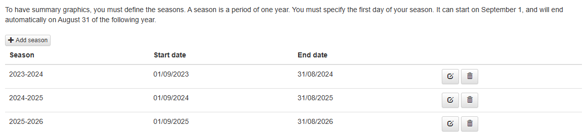

In this part you can create a new Season by specifying the start date.
> This section might disappear in the future.

## Events Management

Here is the list of all events that you created on your installation.

With this you track when you filled your tank, at what price and which quantity, when you emptied the ashtray, when you did the last maintenance and its cost.

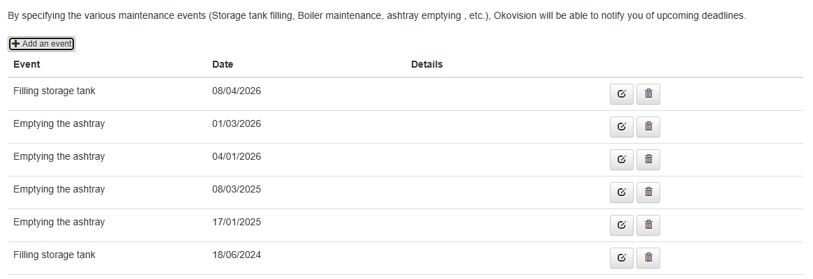

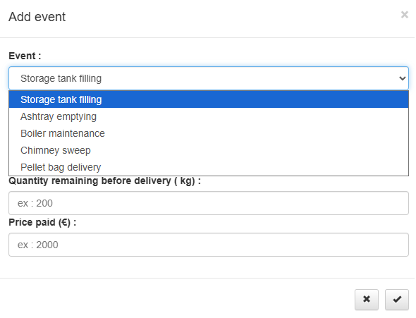

## Matrix

This is where you can see how your installation was properly detected by Okovision (CSV parameters generated by the boiler).

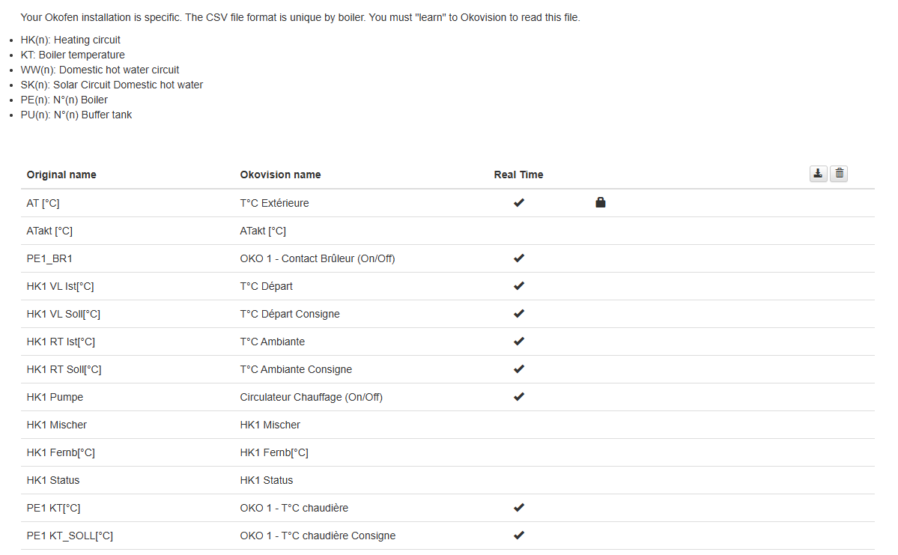

## SQL Backup

In case you want to do a backup of all your history, you can do it from here.

> The Import feature was never activated because it was not secure enough.
So if you want to import your own SQL file, you will need to [do it manually](https://www.ionos.fr/digitalguide/hebergement/aspects-techniques/import-et-export-dune-database-mysql-mariadb/).

**Depending on the age of your installation, this can take some time to get exported.**

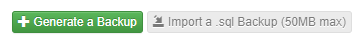

## About

In case of a new release you will be able to install it from here.

You will also find your API token that can be used for doing API calls. See dedicated documentation here.

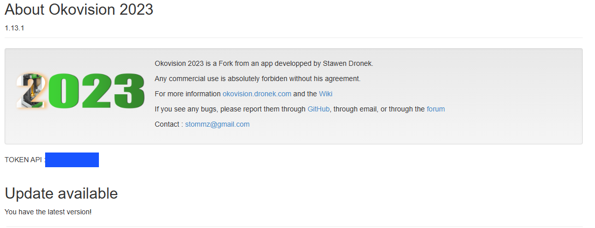